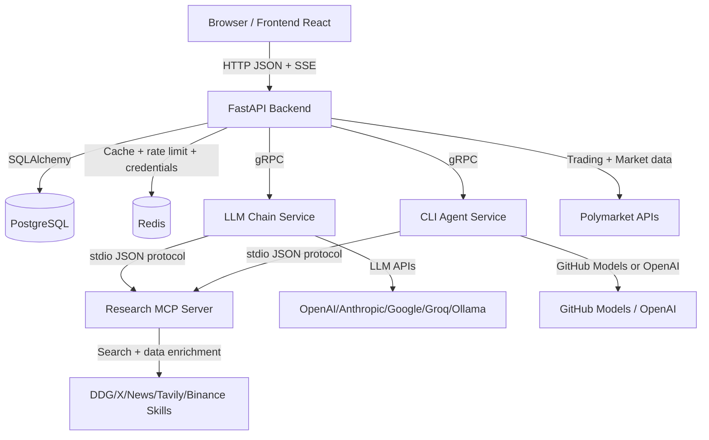
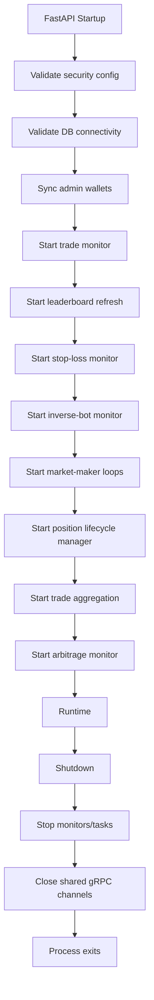

# 01 - System Map

## Goal
Understand the full runtime shape of the platform before touching implementation details.

## High-Level Components
- `frontend/`: React + TypeScript UI (Vite dev server)
- `backend/`: FastAPI API server, business logic, background workers, DB access
- `services/llm-chain/`: gRPC analysis backend with LangChain and multi-provider LLM support
- `services/cli-agent/`: gRPC analysis backend using GitHub Models/OpenAI-compatible flow
- `services/mcps/research/`: MCP-style research tool server (web/x/news/binance context)
- `postgres` (Docker): primary relational database
- `redis` (Docker): rate-limit/cache/credential backing store (with controlled fallbacks)

## End-to-End Request/Data Path
1. Browser sends HTTP request to FastAPI backend.
2. Backend validates auth/session and request schema.
3. Backend route delegates to service layer.
4. If AI is needed, backend calls `AnalysisClient` (gRPC adapter).
5. `AnalysisClient` routes to `llm-chain` or `cli-agent` service.
6. AI service may call research MCP tools and external providers/APIs.
7. Backend combines AI/business results and returns JSON/SSE response.
8. Frontend updates local state/UI.

## Runtime Architecture Diagram

## Backend Lifespan Workers
The backend starts long-running tasks in `backend/app/main.py` lifecycle startup.

Started services include:
- Trade monitor
- Leaderboard background refresh
- Stop-loss monitor
- Inverse-bot monitor
- Market-maker workers
- Position lifecycle manager
- Trade aggregation service
- Arbitrage monitor

## Lifecycle Diagram

## External Integrations (What Can Fail)
- Polymarket CLOB/Gamma/Data APIs
- LLM provider APIs
- GitHub Models API
- Search/news providers
- Redis/Postgres network connectivity

If behavior looks inconsistent, first isolate whether the issue is:
- UI state issue
- API route/service issue
- external API dependency issue
- background worker side-effect issue

## Ownership Notes
- Treat this as a distributed system, not a single app.
- Any feature touching trade execution or credentials spans backend + external APIs + security modules.
- Any feature touching AI analysis spans backend route + gRPC contract + selected AI service implementation.
